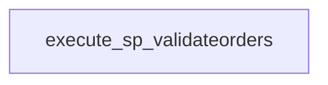

# etl_orders_daily — Requirements Document

## §1 Overview

**Source System:** SSIS  
**Source File:** `tests/fixtures/sample_ssis.dtsx`  
**Detected Pattern:** `GENERAL_ETL`  
**Confidence Score:** 100%  
**Manual Items:** 0

[REVIEWER: Verify the above overview is accurate before approving Stage 2.]

## §2 Data Sources

### Source: oledb_source_orders
Connection: `AzureSqlServer`  
Query/Path: `SELECT OrderId, CustomerId, Amount FROM dbo.Orders`

```yaml
transform_id: oledb_source_orders
transform_type: source_read
source_id: oledb_source_orders
connection_type: jdbc
connection_ref: AzureSqlServer
source_type: query
query_or_path: SELECT OrderId, CustomerId, Amount FROM dbo.Orders
row_count_estimate: '[MANUAL INPUT REQUIRED]'
```

## §3 Data Targets

### Target: oledb_destination_staging
```yaml
transform_id: oledb_destination_staging
transform_type: target_write
target_schema: '[MANUAL INPUT REQUIRED]'
target_table: staging.tmp_orders
write_mode: truncate_insert
```

## §4 Transformations

### Transform: derived_column_transform (derive)
```yaml
transform_id: derived_column_transform
transform_type: derive
expressions:
- output_column: FullName
  expression: ''
```

### Transform: lookup_customer (join)
```yaml
transform_id: lookup_customer
transform_type: join
join_type: left
no_match_behaviour: redirect
```

### Transform: execute_sp_validateorders (sp_call)
```yaml
transform_id: execute_sp_validateorders
transform_type: sp_call
sp_name: dbo.usp_ValidateOrders
sql_statement: EXECUTE dbo.usp_ValidateOrders
connection_ref: AzureSqlServer
sp_rewrite_strategy: keep_plpgsql
sp_estimated_duration_minutes: 5
```

## §5 Business Rules

[MANUAL INPUT REQUIRED: Describe business rules and validation logic here.]

## §6 Control Flow

### SP Dependency DAG


### Adjacency List
```yaml
adjacency_list:
- from_task: Data Flow Task
  to_task: Execute SP ValidateOrders
```

## §7 Error Handling

**OnError**: 

## §8 Schedule & Triggers

[MANUAL INPUT REQUIRED: Specify schedule/trigger for this job.]

## §9 Parameters
- **BatchId** (variable): 0

## §10 Data Quality Rules

[MANUAL INPUT REQUIRED: Define data quality checks for this job.]

## §11 Dependencies
No child package dependencies detected.

## §12 Assumptions & Gaps
No manual items flagged.

[REVIEWER: Address all items above before signing off Stage 1.]